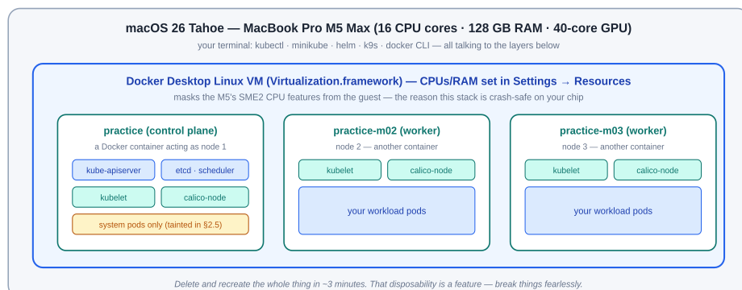

# Part A — Your Lab: Install, Operate, Wrap Up

> The complete record of the environment you built, how to run it day to day, how to leave it clean after each session — and how to unleash the M5 Max when a scenario calls for it.

> **⚠️ SYSTEM REQUIREMENTS** — Apple Silicon Mac (M1–M5; written for the M5 generation) · **macOS 26 Tahoe ≥ 26.5.1** (earlier Tahoe builds have an M5 stability bug under container load) · **Docker Desktop ≥ 4.80** with its VM sized 6 CPU / 8 GB / 60 GB (12 CPU / 48 GB / 120 GB for Scenarios 7–9) · ~80 GB free disk · minikube v1.38+ / Kubernetes v1.34. **Intel Macs and Podman/Colima/QEMU engines are not supported** — on M4/M5 chips those engines expose SME2 CPU features that crash Linux workloads; Docker Desktop masks them. See the README for the full requirements table.

## 1. What You Built (and Why It's M5-Safe)

Your cluster is three Kubernetes nodes running as containers inside Docker Desktop's Linux VM, orchestrated by minikube, with Calico as the CNI so NetworkPolicies actually enforce. One picture:



*Figure 1 — The lab: minikube nodes are containers inside Docker Desktop's VM. They inherit its SME2 masking, which is what keeps this stack stable on M4/M5-generation chips.*

- **Why Docker Desktop?** — The one engine confirmed to mask the M5's SME2 CPU features from Linux guests — Lima/Colima/Rancher (vz) expose them and can SIGILL, Podman machine is confirmed affected, QEMU stacks lagged. Free for personal use.
- **Why minikube?** — One command for a multi-node cluster; one flag for Calico; one-line addons for metrics, ingress, dashboard and CSI snapshots. Simple, easy, yet comprehensive.
- **Why Calico?** — The default minikube CNI does not enforce NetworkPolicy. Calico does — and Scenario 5 depends on it.
- **What this lab can't do** — OS-level node ops (kubeadm upgrades, etcd backup drills — nodes are containers, not VMs) and **GPU passthrough**: no container on macOS can see the Apple GPU. Scenario 9 shows the honest workaround.

## 2. Install Instructions — The Complete Record

Everything we did, in order, with the outputs you saw (or should see on a re-install). Safe to re-run top to bottom on a fresh Mac.

### 2.0 Prepare the Mac

```bash
$ sw_vers
ProductName:        macOS
ProductVersion:     26.5.1          # must be ≥ 26.5.1 (M5 stability fix). Update first if lower.

$ softwareupdate --install-rosetta --agree-to-license   # for occasional x86-only images

# Homebrew, if you don't already have it:
$ /bin/bash -c "$(curl -fsSL https://raw.githubusercontent.com/Homebrew/install/HEAD/install.sh)"
```

### 2.1 Docker Desktop (the engine)

```bash
$ brew install --cask docker-desktop     # or download the Apple Silicon build from docker.com
$ open -a Docker                          # launch it — the daemon only runs while the app does
```

Wait for the menu-bar whale to go steady (30–60 s). Then **Settings → Resources**: **CPUs 6 · Memory 8 GB · Disk 60 GB** for the standard lab (§5 covers the M5 Max upgrade). In **Settings → General** keep VirtioFS on and enable “Use Rosetta for x86_64/amd64 emulation”. Verify:

```bash
$ docker run --rm hello-world
Hello from Docker!
This message shows that your installation appears to be working correctly.
... (arm64v8) ...                        # arm64v8 = native Apple Silicon, no emulation
```

> **THE ERROR YOU ALREADY MET** — `failed to connect to the docker API at unix:///var/run/docker.sock … no such file or directory` while `docker --version` works = the CLI is fine but the **daemon isn't running**. Fix: `open -a Docker` and wait for the whale. If it persists: `docker context ls` — the active context should be `desktop-linux`; if not, `docker context use desktop-linux`. Success test: `docker info` prints a *Server:* section.

### 2.2 The Kubernetes tools (all free, Apache-2.0)

```bash
$ brew install minikube kubectl helm k9s
$ minikube version
minikube version: v1.38.1
$ kubectl version --client
Client Version: v1.36.x
```

### 2.3 Create the cluster

```bash
$ minikube start \
    --profile=practice \
    --driver=docker \
    --nodes=3 \
    --cni=calico \
    --cpus=2 \
    --memory=2200 \
    --kubernetes-version=v1.34.1
😄  [practice] minikube v1.38.1 on Darwin 26.5.1 (arm64)
✨  Using the docker driver based on user configuration
👍  Starting "practice" primary control-plane node in "practice" cluster
🚜  Pulling base image v0.0.4x ...
🔥  Creating docker container (CPUs=2, Memory=2200MB) ...
🐳  Preparing Kubernetes v1.34.1 on Docker 29.x ...
🔗  Configuring Calico (Container Networking Interface) ...
👍  Starting "practice-m02" worker node in "practice" cluster
👍  Starting "practice-m03" worker node in "practice" cluster
🏄  Done! kubectl is now configured to use "practice" cluster and "default" namespace by default
```

### 2.4 Enable the add-ons

```bash
$ minikube addons enable metrics-server      --profile=practice
$ minikube addons enable ingress             --profile=practice
$ minikube addons enable dashboard           --profile=practice
$ minikube addons enable csi-hostpath-driver --profile=practice
$ minikube addons enable volumesnapshots     --profile=practice   # needed for Scenario 3's snapshot step
```

### 2.5 Make it production-shaped, then verify

```bash
# minikube leaves the control plane SCHEDULABLE (so 1-node clusters work).
# We add the production taint ourselves — the control plane needs its resources to manage the cluster.
# Several scenarios assume this taint exists; don't skip it:
$ kubectl taint node practice node-role.kubernetes.io/control-plane=:NoSchedule
node/practice tainted

$ kubectl get nodes
NAME           STATUS   ROLES           AGE     VERSION
practice       Ready    control-plane   5m      v1.34.1
practice-m02   Ready    <none>          4m      v1.34.1
practice-m03   Ready    <none>          3m30s   v1.34.1

$ kubectl get pods -A --field-selector=status.phase!=Running
No resources found                       # everything Running = healthy cluster

$ kubectl top nodes
NAME           CPU(cores)   CPU(%)   MEMORY(bytes)   MEMORY(%)
practice       242m         4%       1180Mi          15%
practice-m02   89m          1%       620Mi           8%
practice-m03   91m          1%       618Mi           8%
# Docker-driver quirk worth knowing: every node reports the WHOLE VM's capacity
# (6 CPUs / 8 GB here) — the --cpus/--memory flags are cgroup hints, not hard node
# walls. Percentages are of the VM, and scheduling math uses the VM-sized capacity.
```

## 3. Daily Operations: Start, Stop, Inspect

## Starting a session

```bash
$ open -a Docker                          # ① engine first — wait for the steady whale
$ minikube start --profile=practice       # ② resume the cluster (state preserved)
😄  [practice] minikube v1.38.1 on Darwin 26.5.1 (arm64)
🔄  Restarting existing docker container for "practice" ...
🏄  Done! kubectl is now configured to use "practice" cluster
$ kubectl get nodes                       # ③ confirm 3 × Ready before working
```

## Stopping (end of session — keeps everything)

```bash
$ minikube stop --profile=practice
✋  Stopping node "practice"  ...
✋  Stopping node "practice-m02"  ...
✋  Stopping node "practice-m03"  ...
🛑  3 nodes stopped.
# Then quit Docker Desktop (whale menu → Quit) to give macOS all its RAM back.
```

## Inspecting — your four windows into the cluster

| Command | What you get |
|---|---|
| `minikube status --profile=practice` | Per-node host/kubelet/apiserver state at a glance. |
| `minikube dashboard --profile=practice` | Opens the web dashboard in your browser (Ctrl-C to stop serving it). |
| `k9s` | Terminal UI — press `:` then a resource name (`pods`, `deploy`, `svc`); `l` for logs, `d` for describe, `0` to show all namespaces. The fastest way to *watch* scenarios happen. |
| `docker stats --no-stream` | What each node container actually consumes on the Mac side. |

## Reaching your apps

```bash
# NodePort / LoadBalancer / Ingress on the docker driver need a bridge to macOS:
$ minikube service <svc-name> --profile=practice       # opens a NodePort service in the browser
$ minikube tunnel --profile=practice                    # run in its OWN terminal; gives LoadBalancer
                                                          # services an IP and binds ingress to 127.0.0.1
                                                          # (asks for sudo — it binds ports 80/443)
$ kubectl port-forward svc/<svc-name> 8080:80           # the always-works fallback
```

## 4. Wrapping Up a Learning Session

A clean lab is a fast lab. Three levels of cleanup, in rising order of finality:

## Level 1 — after every scenario (seconds)

Each scenario in this book creates its own namespace, so cleanup is one line:

```bash
$ kubectl delete namespace <scenario-namespace>
namespace "bookshelf" deleted            # deletes every object inside it — pods, services,
                                           # configmaps, PVCs — one command, nothing orphaned
# PVs from the csi-hostpath driver are reclaimed automatically (Delete policy).
# Confirm no orphaned PVs linger, and remember cluster-scoped objects a scenario
# created (ClusterQueues, taints) are NOT namespaced — their cleanup blocks list them:
$ kubectl get pv
No resources found
```

## Level 2 — end of session (a minute)

```bash
$ minikube stop --profile=practice        # cluster state preserved on disk
$ docker system df                        # how much disk Docker is holding
TYPE            TOTAL   ACTIVE  SIZE      RECLAIMABLE
Images          14      3       11.2GB    6.4GB (57%)
Containers      3       0       1.1GB     0B
Build Cache     42      0       2.1GB     2.1GB
$ docker system prune                     # reclaims dangling images/cache — SAFE while the
                                            # cluster is stopped; don't add -a (it would delete
                                            # the minikube base image and slow the next start)
# Quit Docker Desktop. Done — your Mac is back to normal.
```

## Level 3 — full reset (when a cluster is beyond saving, or you want a fresh start)

```bash
$ minikube delete --profile=practice
🔥  Deleting "practice" in docker ...
💀  Removed all traces of the "practice" cluster.
$ minikube delete --all                   # nukes every profile (practice, fleet, …)
# Rebuild anytime with §2.3 + §2.4 — about 3 minutes. Keep your YAML in a git repo
# (Scenario 8 makes this a habit) and a rebuilt cluster costs you nothing.
```

> **HABIT WORTH FORMING** — Before Level 2, save anything you wrote imperatively: `kubectl get deploy,svc,cm -n <ns> -o yaml > my-work.yaml`. The cluster is cattle; your manifests are the pet.

## 5. Scaling Up the Lab on an M5 Max (128 GB)

The standard 3-node lab fits in 8 GB. Your machine can host something much closer to production shape when a scenario calls for it (Scenarios 7–9 do). Two dials:

1. **Docker Desktop VM** — Settings → Resources: **CPUs 12 · Memory 48 GB · Disk 120 GB**. (With 128 GB you could go higher; 48 GB leaves macOS luxurious headroom.) Apply & restart.
2. **Cluster size** — build a second, bigger profile alongside `practice`:

```bash
$ minikube start --profile=fleet --driver=docker \
    --ha --nodes=9 --cni=calico \
    --cpus=2 --memory=4096 --kubernetes-version=v1.34.1
# --ha: THREE control-plane nodes (real HA topology) + six workers = 9 nodes.
## 9 × 4 GB = 36 GB inside the 48 GB VM — comfortable.

$ kubectl get nodes
NAME        STATUS   ROLES           AGE   VERSION
fleet       Ready    control-plane   8m    v1.34.1
fleet-m02   Ready    control-plane   7m    v1.34.1
fleet-m03   Ready    control-plane   6m    v1.34.1
fleet-m04   Ready    <none>          5m    v1.34.1
...
fleet-m09   Ready    <none>          2m    v1.34.1

# Switch between clusters (it's just a kubeconfig context):
$ kubectl config use-context fleet
$ kubectl config use-context practice
# Run one at a time unless the VM has RAM for both: minikube stop --profile=practice first.
```

> **THE GPU TRUTH** — Your 40-core GPU is invisible to this cluster — macOS containers cannot access Apple's GPU (no Metal inside the Linux VM, no device plugin). Nothing on any local stack changes that today. Scenario 9 uses the honest architecture instead: GPU-accelerated inference runs *natively on macOS* (Ollama with Metal), and the cluster treats it as an external model backend — which is exactly how real platforms treat GPU pools they don't own. Your CPU cores, however, are fully available, and 12 of them make CPU inference genuinely usable.
