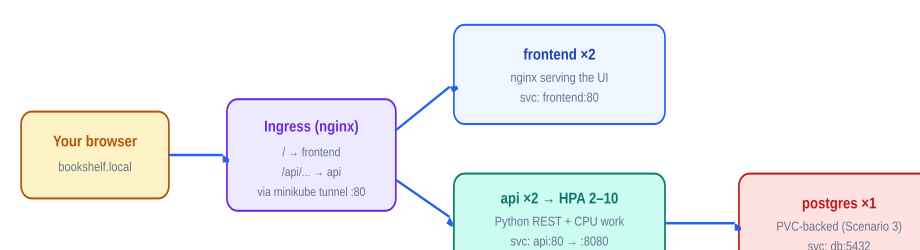

# Scenario 4 — Bookshelf: A Three-Tier App with Ingress & Autoscaling

- **Goal** — Assemble frontend → API → database with Services and Ingress, then load-test it and watch the HPA scale the API tier in real time.
- **Time** — ~90 minutes
- **Concepts** — Deployments & rollouts · Services · Ingress · HPA/metrics



*Figure 2 — Bookshelf: two stateless tiers behind an Ingress, one stateful tier behind a ClusterIP service.*

## Act 1 — The database tier

```bash
$ kubectl create namespace bookshelf && kubectl config set-context --current --namespace=bookshelf
# Reuse Scenario 3's postgres.yaml (Secret + PVC + Deployment), then:
$ kubectl apply -f postgres.yaml
$ kubectl expose deployment postgres --name=db --port=5432
$ kubectl exec -it deploy/postgres -- psql -U postgres -c \
  "CREATE TABLE books(id serial, title text, author text);
   INSERT INTO books(title,author) VALUES
   ('The Phoenix Project','Kim'),('Designing Data-Intensive Applications','Kleppmann'),
   ('Site Reliability Engineering','Beyer'),('Kubernetes Up and Running','Hightower');"
INSERT 0 4
```

## Act 2 — The API tier (with real CPU work for the HPA to feel)

```yaml
# api.yaml — Deployment + Service. The /api/books endpoint queries postgres;
# /api/work burns ~200ms of CPU per call (our load-test target):
apiVersion: apps/v1
kind: Deployment
metadata: {name: api}
spec:
  replicas: 2
  selector: {matchLabels: {app: api}}
  template:
    metadata: {labels: {app: api}}
    spec:
      containers:
      - name: api
        image: python:3.12-slim   # slim, not alpine: psycopg2-binary wheels are guaranteed on glibc
        command: [sh, -c]
        args:
        - |
          pip install --quiet flask psycopg2-binary gunicorn && exec gunicorn -b 0.0.0.0:8080 -w 2 app:app
        workingDir: /app
        env:
        - {name: PGPASSWORD, valueFrom: {secretKeyRef: {name: pg-secret, key: POSTGRES_PASSWORD}}}
        volumeMounts: [{name: code, mountPath: /app}]
        resources:
          requests: {cpu: 200m, memory: 128Mi}   # HPA percentages are OF THIS number
          limits: {cpu: 500m, memory: 256Mi}
        readinessProbe:
          httpGet: {path: /api/books, port: 8080}
          initialDelaySeconds: 10
          periodSeconds: 5
      volumes:
      - name: code
        configMap: {name: api-code}
```

```bash
# The code itself lives in a ConfigMap (configuration decoupled from the container, in practice):
$ cat <<'EOF' > app.py
from flask import Flask, jsonify
import psycopg2, os, math
app = Flask(__name__)
def db(): return psycopg2.connect(host="db", user="postgres", password=os.environ["PGPASSWORD"])
@app.route("/api/books")
def books():
    with db() as c, c.cursor() as cur:
        cur.execute("SELECT title, author FROM books ORDER BY id")
        return jsonify([{"title": t, "author": a} for t, a in cur.fetchall()])
@app.route("/api/work")
def work():
    x = 0.0001
    for _ in range(1_500_000): x = math.sqrt(x + 1.7)   # ~200ms of honest CPU burn
    return jsonify({"pod": os.environ.get("HOSTNAME"), "result": x})
EOF
$ kubectl create configmap api-code --from-file=app.py
$ kubectl apply -f api.yaml
$ kubectl expose deployment api --port=80 --target-port=8080
$ kubectl run test --image=busybox --restart=Never --rm -it -- wget -qO- api/api/books
[{"author":"Kim","title":"The Phoenix Project"}, ...]
```

## Act 3 — Frontend + Ingress

```bash
$ kubectl create configmap ui --from-literal=index.html='<html><body style="font-family:sans-serif">
  <h1>📚 Bookshelf</h1><ul id="b"></ul>
  <script>fetch("/api/books").then(r=>r.json()).then(d=>
    b.innerHTML=d.map(x=>`<li>${x.title} — ${x.author}`).join(""))</script></body></html>'
$ kubectl create deployment frontend --image=nginx:1.27 --replicas=2 --port=80
# Mount the ConfigMap over /usr/share/nginx/html — safe to obliterate that whole
# directory since our index.html replaces nginx's default (contrast: Scenario 6, drill 5):
$ kubectl patch deployment frontend --patch '
spec:
  template:
    spec:
      containers:
      - name: nginx
        volumeMounts: [{name: ui, mountPath: /usr/share/nginx/html}]
      volumes: [{name: ui, configMap: {name: ui}}]'
$ kubectl expose deployment frontend --port=80

# ingress.yaml — one host, two paths:
apiVersion: networking.k8s.io/v1
kind: Ingress
metadata: {name: bookshelf}
spec:
  rules:
  - host: bookshelf.local
    http:
      paths:
      - {path: /api, pathType: Prefix, backend: {service: {name: api, port: {number: 80}}}}
      - {path: /,    pathType: Prefix, backend: {service: {name: frontend, port: {number: 80}}}}
```

```bash
$ kubectl apply -f ingress.yaml
$ echo "127.0.0.1 bookshelf.local" | sudo tee -a /etc/hosts
$ minikube tunnel --profile=practice        # separate terminal, leave running (asks for sudo)
$ curl -s bookshelf.local/api/books | head -c 60
[{"author":"Kim","title":"The Phoenix Project"},{"author":"K
# And open http://bookshelf.local in your browser: your book list, served
# by the frontend, fetched from the API, read from postgres. Three tiers, one URL.
```

## Act 4 — Autoscaling under fire

```bash
$ kubectl autoscale deployment api --cpu-percent=60 --min=2 --max=10
$ kubectl get hpa -w                         # terminal 2 — the show

# terminal 3 — sustained load: 6 parallel clients hammering /api/work:
$ kubectl run load --image=busybox --restart=Never -- /bin/sh -c \
  "for i in 1 2 3 4 5 6; do (while true; do wget -qO- api/api/work >/dev/null; done) & done; sleep 600"

# terminal 2, over ~3 minutes:
NAME   REFERENCE        TARGETS         MINPODS   MAXPODS   REPLICAS
api    Deployment/api   cpu: 41%/60%    2         10        2
api    Deployment/api   cpu: 212%/60%   2         10        2
api    Deployment/api   cpu: 212%/60%   2         10        4        ← scale-out begins
api    Deployment/api   cpu: 118%/60%   2         10        8
api    Deployment/api   cpu: 57%/60%    2         10        8        ← steady state found

$ kubectl delete pod load                    # stop the siege…
# …and ~5 minutes later (default scale-down stabilization window) watch the HPA
# walk the API tier back to 2. Patience here IS the lesson: HPAs scale up fast, down slow.
```

## Act 5 — Ship v2 with zero downtime

```bash
# terminal 2 — a client's-eye view during the rollout:
$ while true; do curl -s bookshelf.local/api/books -o /dev/null -w "%{http_code} "; sleep 0.3; done
# terminal 1 — change the code, roll it out:
$ sed -i '' 's/ORDER BY id/ORDER BY title/' app.py
$ kubectl create configmap api-code --from-file=app.py -o yaml --dry-run=client | kubectl apply -f -
$ kubectl rollout restart deployment api && kubectl rollout status deployment api
Waiting for deployment "api" rollout to finish: 1 old replicas are pending termination...
deployment "api" successfully rolled out
# terminal 2 shows an unbroken wall of "200 200 200 200" — the readiness probe
# gated traffic while new pods warmed up. That's the rolling-update promise, verified.
# Regret it? kubectl rollout undo deployment api.
```

### Act 5b — Now watch the probe save a BAD rollout

```bash
# Ship a broken "v3": point the readiness probe at a path that doesn't exist —
$ kubectl patch deployment api --type=json -p \
  '[{"op":"replace","path":"/spec/template/spec/containers/0/readinessProbe/httpGet/path","value":"/api/nope"}]'
$ kubectl rollout status deployment api
Waiting for deployment "api" rollout to finish: 1 out of 2 new replicas have been updated...
# …and it WAITS THERE FOREVER. Meanwhile terminal 2: still all 200s. Investigate:
$ kubectl get pods
api-5d8c7b9f66-w2kqm   0/1     Running   0     2m   # new pod up but NEVER Ready (0/1) —
                                                       # so the rollout never proceeds and old
                                                       # pods keep serving. Failed deploy, zero
                                                       # user impact. That's the design.
$ kubectl rollout undo deployment api
deployment.apps/api rolled back
```

## Cleanup

```bash
$ kubectl delete namespace bookshelf && kubectl config set-context --current --namespace=default
$ sudo sed -i '' '/bookshelf.local/d' /etc/hosts   # and Ctrl-C the tunnel
```
